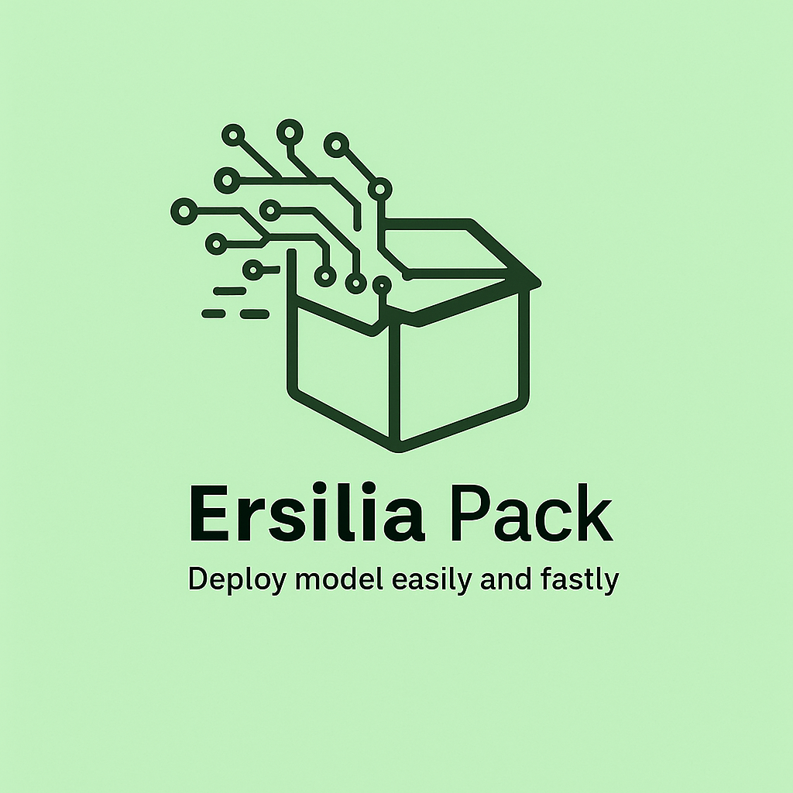

Below is an updated professional README with the requested changes:

---

<p align="center">
  
</p>

<p align="center">
  
  
  
</p>

</p>

# Ersilia-Pack

Ersilia-Pack is a FastAPI-based package designed to seamlessly serve your Ersilia model repository. It provides a comprehensive suite of APIs to monitor, execute, and manage model jobs, alongside detailed metadata support.

---

## Table of Contents

- [Installation](#installation)
- [Usage](#usage)
- [API Documentation](#api-documentation)
  - [Core Endpoints Overview](#core-endpoints-overview)
  - [Additional APIs Overview](#additional-apis-overview)
- [Output Orientation](#output-orientation)
- [For Developers](#for-developers)
- [License](#license)

---

## Installation

Install the package directly from GitHub:

```bash
pip install git+https://github.com/ersilia-os/ersilia-pack.git
```

---

## Usage

Validate your model repository structure by running:

```bash
ersilia_model_lint --repo_path $REPO_PATH
```

Pack your model repository—supporting pip, conda, or both—using:

```bash
ersilia_model_pack --repo_path $REPO_PATH --bundles_repo_path $BUNDLE_PATH
```

For models with conda dependencies, specify a particular conda environment:

```bash
ersilia_model_pack --repo_path $REPO_PATH --bundles_repo_path $BUNDLE_PATH --conda_env_name $CONDA_ENV
```

After packaging, serve the application with:

```bash
ersilia_model_serve --bundle_path $BUNDLE_PATH --port $PORT
```

---

## API Documentation

The Ersilia-Pack API is structured into two main categories: **Metadata** and **App**. Below is an overview of the available endpoints.

### Core Endpoints Overview

- **Documentation Endpoints:**  
  - **Swagger UI (`/docs`):** Provides an interactive API interface with custom styling and title.  
  - **ReDoc (`/redoc`):** Offers an alternative documentation view with a comprehensive layout.

- **Health Monitoring:**  
  - **Health Check (`/healthz`):** Returns detailed system status including CPU, memory usage, and circuit breaker statistics.

- **Root Endpoint:**  
  - **Base URL (`/`):** Displays basic information, typically returning the model identifier and slug from the metadata.

### Additional APIs Overview

#### Job Management

- **Submit Job (`/submit`):**  
  Accepts input data and submits a job for asynchronous processing. Upon submission, a unique job ID is generated and the job is queued.

- **Job Status (`/status/{job_id}`):**  
  Allows users to check the current status of a job (e.g., pending, completed, or failed).

- **Job Result (`/result/{job_id}`):**  
  Retrieves the output of a completed job. If the job is not finished, it returns the current status with no result.

- **Reset Jobs (`/jobs/reset`):**  
  Clears all job records. *(Note: For production, secure this endpoint with proper administrative authentication.)*

#### Metadata Endpoints

- **Complete Metadata (`/card`):**  
  Retrieves all metadata related to the model, including its name, title, and description.

- **Specific Metadata Field (`/card/{field}`):**  
  Fetches a specific metadata field. Returns an error if the field is not found in the metadata.

#### Run Endpoints

- **Example Data Endpoints:**  
  - **Example Input (`/run/example/input`):** Provides sample input data for testing.  
  - **Example Output (`/run/example/output`):** Returns sample output data to demonstrate expected responses.  
  - **Input Columns (`/run/columns/input`):** Lists the input data headers.  
  - **Output Columns (`/run/columns/output`):** Lists the output data headers.

- **Execute Job (`/run`):**  
  Supports synchronous execution by processing the input data and returning computed results directly.

#### Model Information

- **Model Status (`/models/status`):**  
  Provides comprehensive details about the model, including version, runtime environment, and current worker statuses.

---

## Output Orientation

API responses are always provided in JSON format, following the Pandas DataFrame `orient` syntax. Supported output orientations include:
- **records:** Each row is output as a dictionary.
- **split:** Returns separate lists for index, columns, and data.
- **columns:** Outputs a dictionary with column names as keys and lists of values as entries.
- **index:** Outputs a dictionary with indices mapping to corresponding row data.
- **values:** Outputs a list of lists, with each sublist representing a row.

For more details, please refer to the [Pandas to_json documentation](https://pandas.pydata.org/docs/reference/api/pandas.DataFrame.to_json.html).

---

## Features

- **Interactive API Documentation:**  
  Offers both Swagger UI and ReDoc interfaces with custom styling and titles, ensuring a user-friendly API exploration experience.

- **Asynchronous Job Processing:**  
  Supports the submission and execution of jobs asynchronously. Users receive a unique job ID and can track job status and results, with robust error handling.

- **Real-time Health Monitoring:**  
  Monitors system performance including CPU and memory usage, as well as circuit breaker metrics, to ensure reliable service operations.

- **Flexible Metadata Access:**  
  Provides endpoints to retrieve complete metadata or specific metadata fields, offering a clear view of model details such as name, title, and description.

- **Comprehensive Run Endpoints:**  
  Facilitates example data retrieval for both input and output, along with dynamic job execution, enabling easy testing and validation of model predictions.

- **Modular and Extensible Design:**  
  Structured to separate metadata access and job processing logic, making it straightforward to extend and integrate additional functionalities as needed.

- **Multiple Output Formats:**  
  Supports various output orientations (records, split, columns, index, and values) based on the Pandas DataFrame `to_json` syntax, allowing flexible JSON responses.

---

## For Developers

- **Input Handling:**  
  Currently, only `"Compound"` and `"Single"` input types are supported. To accommodate additional types, update the schemas within the `templates/input_schemas` directory.

- **Best Practices:**  
  Follow standard FastAPI conventions. Ensure that any new features are well-documented and thoroughly tested.

- **Extensibility:**  
  The modular design of Ersilia-Pack allows you to easily integrate new endpoints and custom logic to extend functionality as needed.

---

## License

This project is licensed under the [MIT License](LICENSE).

---

This README offers a comprehensive yet concise overview of Ersilia-Pack, its installation and usage instructions, and the structure of its API endpoints. Both end users and developers can quickly find the information they need to work with or contribute to the project.